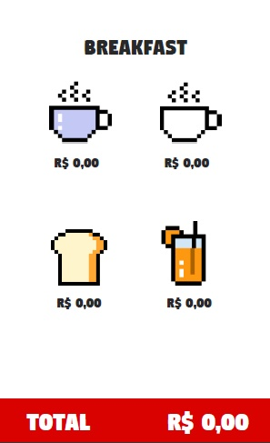
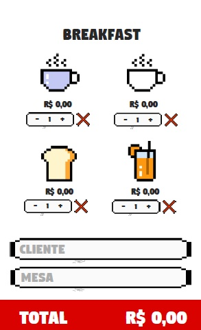

# Burger Queen

## Índice

* [1. Resumo do projeto](#2-resumo-do-projeto)
* [2. Objetivos de aprendizagem](#3-objetivos-de-aprendizagem)
* [3. Protótipo de baixa fidelidade](#4-prototipo-de-baixa-fidelidade)

***

# 1. Resumo do projeto
O projeto consiste em criar um aplicativo de restaurante onde o usuário poderá ver as opções do cardápio,
saber os preços, adicionar e excluir os itens do pedido e aumentar a quantidade dos itens, colocar o nome do cliente e da mesa, assim como saber o valor total do pedido.

## 2. Objetivos de aprendizagem
Aprender a linguagem de programação de React e manipulação de banco de dados usando firebase.

### 3. Protótipo de baixa fidelidade

